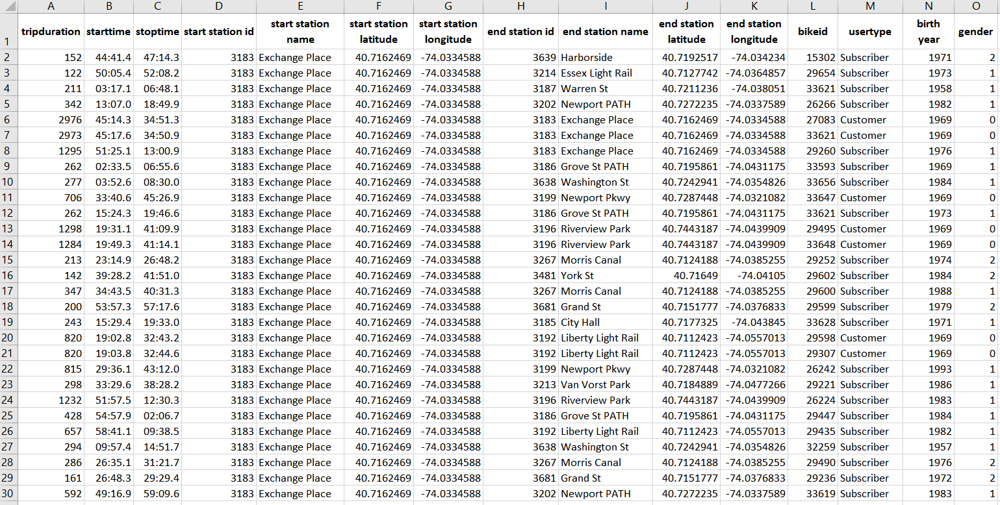

# NY-Citi-Bike-Analytics---Tableau-Project

Used Tableau to aggregate, model, analyze, and visualize the data of the largest bike-sharing program in the United States. 

**Metadata:**

Based on the created visualizations, several unexpected phenomena that would help improve the city program were found. 

Generated a Tableau story that brings together the visualizations, maps, and insights for presenting to customers easily.

*[Click here](https://public.tableau.com/profile/ruozhuo.wang#!/vizhome/Homework_week20_RuozhuoWang/Story1?publish=yes)* to view the dashboards presenting all visualizations and insights on Tableau Public.

https://public.tableau.com/profile/ruozhuo.wang#!/vizhome/Homework_week20_RuozhuoWang/Story1?publish=yes
